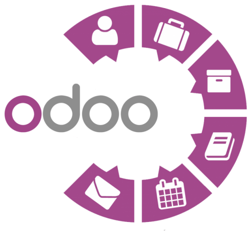

<!-- Autor: Jonay Contreras Rodriguez -->

### Índice

- [Informe Odoo](#informe-odoo)
    - [¿Qué es Odoo?](#¿qué-es-odoo)
    - [Historia resumida de Odoo](#historia-resumida-de-odoo)
    - [Módulo de operaciones. Componentes Principales](#módulo-de-operaciones-componentes-principales)
    - [Módulo de ventas. Componentes Principales](#módulo-de-ventas-componentes-principales)
    - [Módulos de sitio web. Componentes Principales](#módulos-de-sitio-web-componentes-principales)
- [Dossier](#dossier)
    - [Práctica 2](#pŕactica-2)
---

 ### Informe Odoo
- #### ¿Qué es Odoo?
    - Odoo es un sistema de gestión empresarial (ERP, por sus siglas en inglés: Enterprise Resource Planning) de código abierto. Proporciona una suite completa de aplicaciones empresariales que abarcan diversas áreas, como contabilidad, ventas, inventario, recursos humanos y más. Su objetivo es ayudar a las empresas a integrar y gestionar eficientemente sus procesos y datos.

- #### Historia resumida de Odoo
    - Odoo, anteriormente conocido como OpenERP, fue creado por Fabien Pinckaers en 2005. Inicialmente, se centraba en el desarrollo de módulos específicos para gestionar diferentes aspectos empresariales. Con el tiempo, evolucionó y se expandió, convirtiéndose en una suite integral que abarca múltiples áreas funcionales. En 2014, la empresa adoptó el nombre Odoo para reflejar mejor su alcance y enfoque global.

- #### Módulo de operaciones. Componentes Principales
    - El módulo de operaciones de Odoo abarca áreas como inventario, compras y fabricación. Sus componentes principales incluyen la gestión de inventario para controlar las existencias, la gestión de compras para realizar adquisiciones eficientes y la gestión de fabricación para supervisar y controlar los procesos de producción.

- #### Módulo de ventas. Componentes Principales
    - El módulo de ventas en Odoo se centra en la gestión de las actividades relacionadas con la venta de productos o servicios. Sus componentes principales incluyen la gestión de clientes, la creación de presupuestos y pedidos, el seguimiento de oportunidades de venta, la facturación y la generación de informes para analizar el rendimiento de las ventas.

- #### Módulos de sitio web. Componentes Principales
    - Los módulos de sitio web en Odoo están diseñados para gestionar la presencia en línea de una empresa. Sus componentes principales abarcan la creación y personalización de páginas web, la integración de tiendas en línea, el seguimiento de visitantes, la gestión de contenido y la optimización para motores de búsqueda (SEO), permitiendo así una presencia web efectiva y atractiva.

### Dossier

- #### Pŕactica 2
    - Realiza un pequeño documento donde expliques con tus palabras la diferencia entre un ERP, un CRM, un CMS y una aplicación de E-Learning. 
        - Diferencias ERP, CRM, CMS, y E-Learning:
        
            - El ERP se encarga de gestionar todas las funciones o metodos que necesiten, mientras que un CRM es uno de esos servicios que se podrían gestionar con el ERP, este servicio se encarga de mejorar la relacion con el cliente, con distintas caracteristicas. 

            - Después estos se diferencian del CMS en que el CMS es un servicio web que facilita a la empresa a mantener paginas webs o blogs actualizados facitilando características como la programación de entradas o la facil introducción de estos.
            - Y por último, el E-Learning, es facilitar a la formación utilizando elementos digitales.

            - Como podemos percatarnos, todo entran dentro del ERP, y después cada uno agraga sus funcionalidades.
    - Termina el trabajo ubicando en alguna de esas categorías los siguientes programas:

        - OpenBravo: 

        - Microsoft Dynamics:

        - OpenERP:

        - Drupal:

        - Joomla:

        - WordPress:

        - OpenCMS:

        - SAP:

        - Blogger:

        - Moodle:

        - DropBox:

